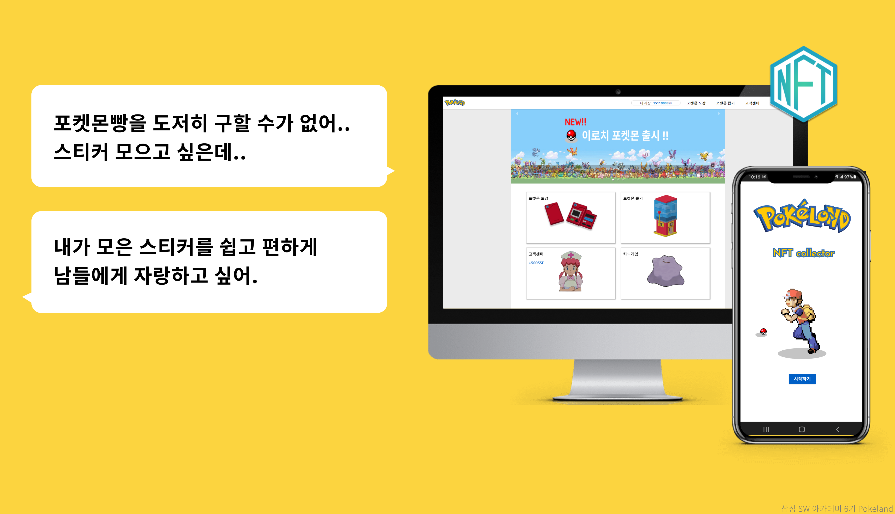
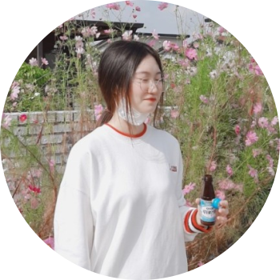

# 📑 SSAFY 6기 특화 프로젝트 - PokeLand

## 블록체인 NFT활용한 프로젝트


<br>

# :clapper: OverView 

---

포켓몬 빵 드셔보신 분 있으신가요? 포켓몬 빵이 재출시된 이후 한 번도 먹어보지 못했습니다
포켓몬 빵 대란이라고 하죠. 스티커 하나가 자그마치 **5만원**에 판매되기도 하는 것도 아시나요?
이 포켓몬 스티커를 NFT로 얻을 수 있다면??

<br>

# :triangular_flag_on_post: 서비스 초기 목표 

---

유저에게 쉽게 다가갈 수 있는 프로젝트
최대한 많은 유저가 사용하는 프로젝트, 거기에서 나오는 피드백 대로 프로젝트를 진행하는 애자일을 경험하자.
**MVP**프로젝트를 만들자

<br>

# 🎉 PokeLand 서비스 화면 

---

### :mobile_phone_off: [모바일버전](README.assets/ServiceEx/mobile.md)

### :computer: [PC버전](README.assets/ServiceEx/pc.md)

<br>

# ✨ 주요기능 

---

- 서비스 설명 : 포켓몬을 뽑아 NFT로 민팅하여 제공

- 주요 기능 :
  - 포켓몬을 NFT로 민팅
  - 토큰을 얻기 위한 미니게임
  - 보유하고 있는 NFT를 확인할 수 있는 포켓몬 도감

<br>

# :desktop_computer: 개발 환경

---

## 💻 BackEnd

- Intellij
- Spring-Boot : 2.6.4
- Spring-Boot-JPA
- Spring Security
- Java 11
- web3j
- maria db
- Lombok

## ✨ Front-End

- Visual Studio Code
- react@17.0.2
- redux@4.1.2
- react-redux@7.2.6
- sass@1.49.9

## 🖱 BlockChain

- truffle
- solidity
- ipfs.io
- OpenZeppelin

## :earth_africa: Infra

- AWS EC2 - Deploy Server
- docker
- jenkins
- docker-compose
- nginx

## 👨‍👩‍👧 협업 툴

- GitLab
- Jira
- Nortion
- Mattermost
- Webex
- Discord

---

<br>

# :earth_asia: 서비스 아키텍쳐

---


<br>

# :heart_eyes: 피드백

---


<br>

# :hammer_and_wrench: 개선사항

---

|  |  |
| --------------------------------------------------------------------------------------------------------------- | --------------------------------------------------------------------------------------------------------------- |
|                                                                                                                 |                                                                                                                 |

<br>

# 🧨화면 설계서

---


<br>

# :notebook_with_decorative_cover: REST API 문서화

---


<br>

# 🎇Git 컨벤션

---

```
feat : 새로운 기능 추가
fix : 버그 수정
docs : 문서 수정
chore : 그 외 자잘한 작업
test : 테스트 코드
build : 시스템 또는 외부 종속성에 영향을 미치는 변경사항 (npm, gulp, yarn 레벨)
ci : CI관련 설정
style : 코드 의미에 영향을 주지 않는 변경사항 (포맷, 세미콜론 누락, 공백 등)
refactor : 성능 개선
```

<br>

# 🎇Code 컨벤션

---

- 클래스 및 인터페이스 이름 : Pascal Case

- Method 및 변수 이름 camel Case
- 의존성 주입 : 생성자 주입
  - @RequiredArgsConstructor를 사용
- REST API
  - 응답 요청 모두 String(PK, StudyTime 제외)

<br>

# :bar_chart: GitLab Flow 브랜치 전략 

---

.png)

<br>

# :electric_plug: EC2 포트 정리

---

| **PORT** |                        **이름**                         |
| :------: | :-----------------------------------------------------: |
|   443    |                          HTTPS                          |
|    80    | HTTP - HTTPS로 리다이렉트(프론트 페이지지로 리다이렉트) |
|   3306   |                        Maria DB                         |
|   9999   |                         Jenkins                         |
|   8080   |              Spring boot Docker Container               |
|   3000   |            React.js, NginX Docker Container             |

<br>

# 🎨 PokeLand 프로젝트팀을 소개합니다.

---

|               김태호               |             박윤지             |           서형준            |           오윤기            |              현종일              |
| :--------------------------------: | :----------------------------: | :-------------------------: | :-------------------------: | :------------------------------: |
|           |       |    |    |         |
|       **Leader & Frontend**        |          **Backend**           |         **Backend**         |     **Backend , CI/CD**     |           **Frontend**           |
| https://github.com/onys-programmer | https://github.com/underwater2 | https://github.com/kenny397 | https://github.com/Yun-GiOh | https://github.com/Leo-SingleDay |

<br>

# 🤟 팀원 역할

---

#### :heavy_check_mark: 김태호 [싼타파이브 선배님들~ 저희는 드루이드6입니다~!]

- 애자일 경험 희망자 대상으로 팀 빌딩
  - 프로젝트 매니지먼트 및 작업 분배
- 포케랜드 UI UX 설계, 구현
  - 웹, 모바일 모두 적용 가능한 반응형 UI 구현
- 프론트엔드 아키텍처 설계, 구현
- 팀 내 리액트 교육
- 코드리뷰 및 리팩토링
- 포켓몬 스티커 구현
- 포켓몬 도감 구현
  - 페이지네이션 직접 구현
  - 포켓몬 도감 상세화면 구현
- 포켓몬 뽑기 초기화면 구현
- 고객센터 구현

#### :heavy_check_mark: 박윤지 [포케랜드 제대로 즐겨보자! 🤗]

- NFT 도감 구현
  - JPA 사용
- 고객센터 구현
  - 관리자 메일로 사용자 입력 내용 전송
  - Java Mail Sender 사용
- REST API 및 ERD 설계
- 이로치 포켓몬 제작
- notion 소개 페이지 제작
- 소개 UCC 제작

#### :heavy_check_mark: 서형준 [ 블록체인을 배워보자 😤 ]

- 서비스 기획
- 뽑기 API 구현
  - init APi 구현
  - 유저 관리 API 구현
- spring security, JWT JPA를 이용한 회원가입 로그인 기능 구현
  - ERC721 기반 NFT 스마트컨트랙트 구현 및 배포
  - web3j를 통한 이더리움 네트워크와 통신
  - 이더리움 지갑 생성
  - 에러 처리

#### :heavy_check_mark: 오윤기 [ 배포는 나한테 맡겨! 👍]

- 포케랜드 주제 제안 및 기획
- REST API 및 ERD 설계
- Jenkins pipeline을 활용한 배포 자동화 시스템 구축
  - Docker와 NGINX 활용
  - Webhook 발생시 새로운 컨테이너가 자동으로 실행됨
- Python을 활용한 크롤링 및 NFT 데이터 랜덤 생성
  - selenium을 활용한 NFT 구성 데이터 수집
  - 구성요소마다 가중치를 두어 유일한 NFT 메타 데이터 제작
- ipfs.io 서버에 NFT 메타데이터 저장 작업
- 회원가입 정보 유효성 검사 및 이메일 인증 구현

#### :heavy_check_mark: 현종일 [ 사용자가 불편하다고? 당장 고칠게요 ! 😎 ]

- 포케랜드 UI UX 설계, 구현

  - 웹, 모바일 모두 적용 가능한 반응형 UI 구현

- 코드 리뷰 및 리팩토링

- BGM 구현

- 공용 컴포넌트 재사용화

  - Modal, Loading Spinner

- 구현페이지

  - 회원가입 / 로그인
  - 미니게임
  - Sidebar
  - 메인페이지
  - 포켓몬뽑기
  - 튜토리얼
  - 인트로 페이지

  

  

  
