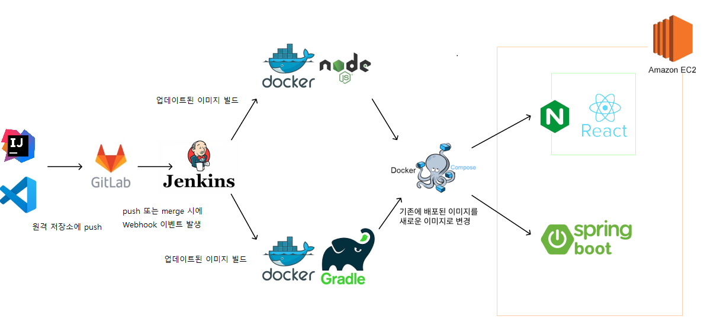

## 1. 아키텍처 구성도




## 2. 배포 자동화 과정
- GitLab Master Repository에 Push또는 Merge가 되면 Webhook이 발생하여 Jenkins pipeline이 빌드와 배포를 자동으로 실행한다.
- Pipeline Scripts로 프론트와 백엔드 root folder에 있는 Dockerfile을 빌드하고 docker-compose yaml으로 도커를 통합배포한다.


### !배포 자동화에 필요한 환경 구성
- ssh 클라이언트로 서버 원격 접속
- ubuntu 업데이트 및 업그레이드
- 필요 의존성 및 패키지 설치
		- docker
        - nginx
        - jenkins
        
### 2-1. ssh 클라이언트로 서버 원격 접속
ssh 프로토콜을 이용해서 인스턴스 내부에 접근하기 위해서는 ssh 클라이언트가 존재해야 한다.
MobaXterm를 활용하여 AWS EC2로 원격접속함.


### 2-2. ubuntu 업데이트 및 패키지 설치
인스턴스에 접속을 했다면 ubuntu 를 업데이트해줘야 합니다.
```
$ sudo apt update -y
$ sudo apt upgrade -y
```
를 입력하시면 업데이트와 업그레이드가 진해됩니다.

### 2-3. 필요 의존성 및 패키지 설치
docker 설치를 위해
```
$ sudo apt install -y docker.io
```
nginx 설치를 위해
```
$ sudo apt install -y nginx
```
명령어을 터미널에 입력합니다. 

<br>
jenkins를 설치하기위해 jdk를 먼저 설치해야합니다.

```
$ sudo apt install -y openjdk-11-jdk
$ wget -q -O - https://pkg.jenkins.io/debian/jenkins-ci.org.key | sudo apt-key add
$ echo deb http://pkg.jenkins.io/debian-stable binary/ | sudo tee /etc/apt/sources.list.d/jenkins.list
$ sudo apt-key adv --keyserver keyserver.ubuntu.com --recv-keys FCEF32E745F2C3D5
$ sudo apt update -y
$ sudo apt install -y jenkins
```
명령어를 순서대로 수행하면 jenkins 설치가 완료됩니다. 그리고 jenkins는 8080포트로 설정됨으로 포트가 겹치는 서비스가 존재하는 경우, 포트를 변경해야합니다. 
저희는 9999포트로 변경해 사용했습니다.

### 2-4. 프론트엔드 도커라이징

* frontend dockerfile
```
FROM node:latest AS build

WORKDIR /app
COPY package* ./
RUN npm install 
COPY public ./public 
COPY src ./src
RUN npm run build

# 2. 빌드 된 파일을 배포용 이미지에 복사
FROM nginx:alpine
COPY nginx.conf /etc/nginx/conf.d/default.conf
COPY --from=build /app/build /usr/share/nginx/html
EXPOSE 3000
CMD ["nginx", "-g", "daemon off;"]
```

### 2-5. 프론트엔드 NGINX 설정 추가
NIGNX에서 SPA 기반 프레임워크 사용시 발생하는 404 refresh 문제를 해결하기 위한 조치입니다.<br>
* nginx conf
```
server {
    listen       80;
    server_name  localhost;

    location / {
        root   /usr/share/nginx/html;
        index  index.html index.htm;
        try_files $uri /index.html;                 
    }

    error_page   500 502 503 504  /50x.html;
    location = /50x.html {
        root   /usr/share/nginx/html;
    }
}
```

### 2-6. 백엔드 도커라이징
* backend dockerfile
```
FROM openjdk:11 AS build
WORKDIR /app
COPY gradlew .
COPY gradle gradle
COPY build.gradle .
COPY settings.gradle .
COPY src src
RUN chmod +x gradlew
RUN ["./gradlew", "clean", "build", "--stacktrace", "--exclude-task", "test"]


FROM openjdk:17-ea-11-jdk-slim
COPY --from=build /app/build/libs/b208-0.0.1-SNAPSHOT.jar app.jar
EXPOSE 8080
ENTRYPOINT ["java", "-jar", "app.jar"]
```

### 2-7. docker-compose
* docker-compose.yml
```
version: "3"
services: 
  frontend:
    container_name: frontend
    build: 
      context: ./frontend/pokemon
    ports: 
      - 3000:80
    networks:
      - pokeworld
    restart: unless-stopped
    depends_on:
      - backend
  backend:
    container_name: backend
    build: 
      context: ./backend
    ports: 
      - 8080:8080
    networks:
      - pokeworld
    restart: unless-stopped
    
networks: 
  pokeworld:
```

### 2-8. nginx 환경 설정
서버의 /etc/nginx의 nginx.conf 파일을 이용해 프록시 패스와 https 보안접속을 적용합니다.<br>
* nginx.conf
```
worker_processes  1;

events {
    worker_connections  1024;
}

http {
  include       /etc/nginx/mime.types;
  default_type  application/octet-stream;

  upstream front-server {
    server 127.0.0.1:3000;
    keepalive 100;
  }

  upstream backend-server {
    server 127.0.0.1:8080;
    keepalive 100;
  }

  server {
    server_name j6b208.p.ssafy.io;

    location / {
      proxy_pass http://front-server;

      proxy_set_header HOST $host;
      proxy_set_header Referer $http_referer;
    }

    location /api {
      proxy_pass http://backend-server;

      proxy_set_header HOST $host;
      proxy_set_header Referer $http_referer;
    }

    error_page 404 /404.html;
      location = /40x.html {
    }

    error_page 500 502 503 504 /50x.html;
    location = 50x.html {
      root /usr/share/nginx/html;
 }

    listen [::]:443 ssl ipv6only=on; # managed by Certbot
    listen 443 ssl; # managed by Certbot
    ssl_certificate /etc/letsencrypt/live/j6b208.p.ssafy.io/fullchain.pem; # managed by Certbot
    ssl_certificate_key /etc/letsencrypt/live/j6b208.p.ssafy.io/privkey.pem; # managed by Certbot
    include /etc/letsencrypt/options-ssl-nginx.conf; # managed by Certbot
    ssl_dhparam /etc/letsencrypt/ssl-dhparams.pem; # managed by Certbot

  }

  server {
    if ($host = j6b208.p.ssafy.io) {
        return 301 https://$host$request_uri;
    } # managed by Certbot


        listen 80 default_server;
        listen [::]:80 default_server;

        server_name j6b208.p.ssafy.io;
    return 404; # managed by Certbot
  }

}
```
ssl 인증서는 Let's encrypt와 certbot을 활용했습니다.

### 2-9. jenkins pipeline script
```
pipeline {
    agent any

    stages {
        stage('Clone') {
            steps {
                dir('pokeworld') {
                    git(
    	                url: 'https://lab.ssafy.com/s06-blockchain-nft-sub2/S06P22B208.git',
    	                credentialsId: 'gitlab',
    	                branch: 'master'
	                )
                }
            }
        }
    
        stage('Build') {
            parallel {
                stage('Frontend Build'){
                    steps {
                        dir('pokeworld/frontend/pokemon') {
                            sh "docker build -t pokeworld_frontend ."
                        }
                    }
                }
                stage('Backend Build'){
                    steps {
                        dir('pokeworld/backend') {
                            sh "docker build -t pokeworld_backend ."
                        } 
                    }
                }      
            }
        }
        stage('Deploy') {
            steps {
                dir('pokeworld') {
                    sh "docker-compose down"
                    sh "docker system prune -a"
                    sh "docker-compose up -d --build"
                }
	                
            }
        }
    }
}
```

위의 작업을 모두 진행하고 AWS의 터미널로 ```docker ps``` 를 입력하면 프론트와 백엔드 도커 콘테이너가 실행되는 것을 확인할 수 있습니다.

### DB
- ```docker run --name mariadb -e MARIADB_ROOT_PASSWORD= -p 3306:3306 -d mariadb/server:latest``` 명령어를 통해 Mariadb를 도커 컨테이너로 생성후 이용했습니다.
